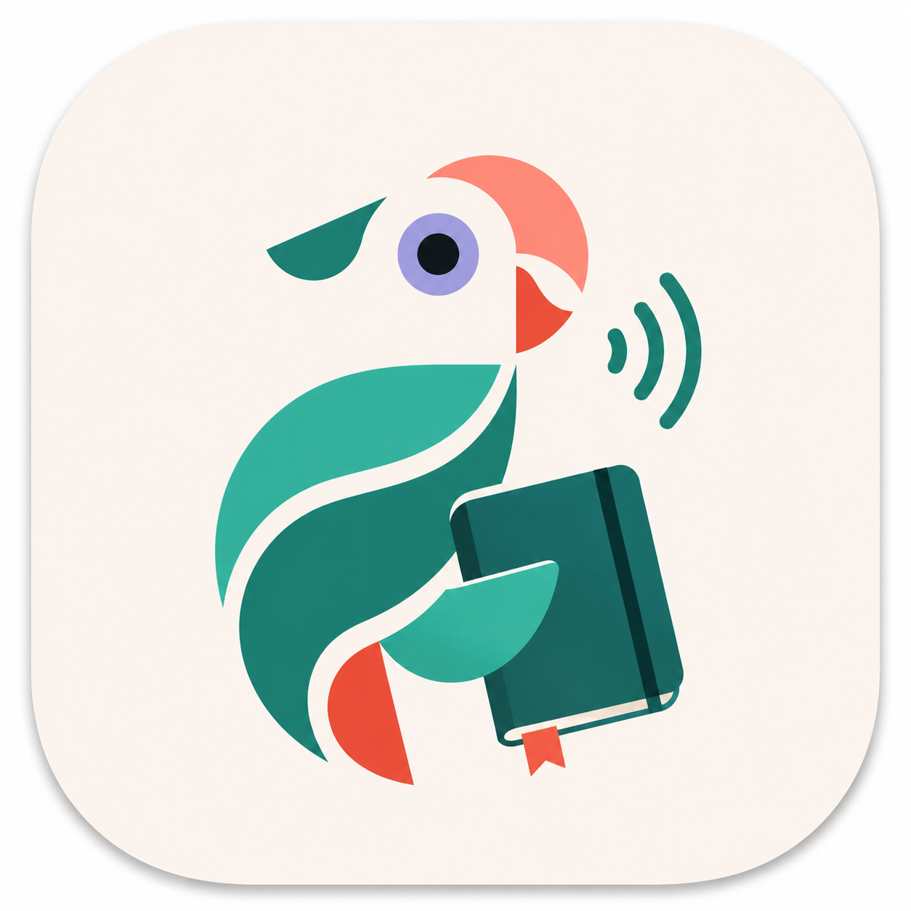

<p align="center">
  
</p>

## <h1 align="center">LingoDiary</h1>

Write diary entries in your own language. LingoDiary turns them into TPRS-style audio lessons — translated sentences, Q&A pairs, and multiple grammatical variants — ready to listen on your phone or in the browser.

## Quick start

**You need:** Docker, Docker Compose, and an OpenAI API key.

Create a `docker-compose.yml` anywhere on your machine:

```yaml
services:
  lingo-diary:
    image: lozzaroo/lingodiary
    ports:
      - 8083:8084
    volumes:
      - ~/.config/lingoDiary/:/app/.config/lingoDiary/
      - ~/Documents/lingodiary/:/data/
    environment:
      SECRET_KEY: "change-me-to-a-random-string"
```

Then create the directories and config files the container expects (replace `myuser` with your username):

```bash
mkdir -p ~/.config/lingoDiary/myuser
mkdir -p ~/Documents/lingodiary/myuser
```

Generate a bcrypt hash for your password:

```bash
python3 -c "import bcrypt; print(bcrypt.hashpw(b'yourpassword', bcrypt.gensalt()).decode())"
```

Create `~/.config/lingoDiary/users.yaml`:

```yaml
users:
  myuser:
    password: "$2b$12$..." # paste your bcrypt hash here
    language: "en"
```

Create `~/.config/lingoDiary/myuser/config.yaml`:

```yaml
openai:
  key: "sk-..."
  model: "gpt-4o-mini"

languages:
  primary_language: "english" # the language you write your diary in
  primary_language_code: "en"
  study_language: "norwegian" # the language you are learning
  study_language_code: "no"

gender: "male"

tts:
  model: "piper"
  piper:
    voice: "talesyntese-medium" # study language voice
    piper_length_scale_tprs: 2 # speech speed (higher = slower)
    piper_length_scale_diary: 2
  piper_input_language:
    voice: "en_GB-alan-medium" # native language voice (enables Drive Mode)
  repeat_sentence_tprs: 2
  repeat_sentence_diary: 2
  pause_between_sentences_duration: 600
  answer_silence_duration: 5000
```

<details>
<summary>Available Piper voices</summary>

Use the **short name** (e.g. `talesyntese-medium`, `alan-medium`, `ryan-medium`). Both short form and full `lang_REGION-name-quality` form are accepted. Qualities: `x_low` < `low` < `medium` < `high`.

**Albanian** — `edon-medium`

**Arabic** — `kareem-low`, `kareem-medium`

**Basque** — `antton-medium`, `maider-medium`

**Bulgarian** — `dimitar-medium`

**Catalan** — `upc_ona-medium`, `upc_ona-x_low`, `upc_pau-x_low`

**Chinese** — `huayan-medium`, `huayan-x_low`

**Czech** — `jirka-low`, `jirka-medium`

**Danish** — `talesyntese-medium`

**Dutch (BE)** — `nathalie-medium`, `nathalie-x_low`, `rdh-medium`, `rdh-x_low`

**Dutch (NL)** — `alex-medium`, `mls-medium`, `pim-medium`, `ronnie-medium`

**English (GB)** — `alan-low`, `alan-medium`, `alba-medium`, `aru-medium`, `cori-high`, `cori-medium`, `jenny_dioco-medium`, `northern_english_male-medium`, `semaine-medium`, `southern_english_female-low`, `vctk-medium`

**English (US)** — `amy-low`, `amy-medium`, `arctic-medium`, `bryce-medium`, `danny-low`, `hfc_female-medium`, `hfc_male-medium`, `joe-medium`, `john-medium`, `kathleen-low`, `kristin-medium`, `kusal-medium`, `lessac-high`, `lessac-low`, `lessac-medium`, `libritts-high`, `libritts_r-medium`, `ljspeech-high`, `ljspeech-medium`, `norman-medium`, `ryan-high`, `ryan-low`, `ryan-medium`

**Farsi** — `amir-medium`, `ganji-medium`, `gyro-medium`

**Finnish** — `harri-low`, `harri-medium`

**French** — `gilles-low`, `mls-medium`, `mls_1840-low`, `siwis-low`, `siwis-medium`, `tom-medium`, `upmc-medium`

**Georgian** — `natia-medium`

**German** — `eva_k-x_low`, `karlsson-low`, `kerstin-low`, `pavoque-low`, `ramona-low`, `thorsten-high`, `thorsten-low`, `thorsten-medium`, `thorsten_emotional-medium`

**Greek** — `rapunzelina-low`, `rapunzelina-medium`

**Hindi** — `pratham-medium`, `priyamvada-medium`, `rohan-medium`

**Hungarian** — `anna-medium`, `berta-medium`, `imre-medium`

**Icelandic** — `bui-medium`, `salka-medium`, `steinn-medium`, `ugla-medium`

**Indonesian** — `news_tts-medium`

**Italian** — `paola-medium`, `riccardo-x_low`

**Kazakh** — `iseke-x_low`, `issai-high`, `raya-x_low`

**Luxembourgish** — `marylux-medium`

**Nepali** — `chitwan-medium`, `google-medium`, `google-x_low`

**Norwegian** — `nvcc-medium`, `talesyntese-medium`

**Polish** — `bass-high`, `darkman-medium`, `gosia-medium`, `mc_speech-medium`, `mls_6892-low`

**Portuguese (BR)** — `cadu-medium`, `edresson-low`, `faber-medium`, `jeff-medium`

**Portuguese (PT)** — `tugão-medium`

**Romanian** — `mihai-medium`

**Russian** — `denis-medium`, `dmitri-medium`, `irina-medium`, `ruslan-medium`

**Serbian** — `serbski_institut-medium`

**Slovak** — `lili-medium`

**Slovenian** — `artur-medium`

**Spanish (AR)** — `daniela-high`

**Spanish (MX)** — `ald-medium`, `claude-high`

**Spanish (ES)** — `carlfm-x_low`, `davefx-medium`, `mls_10246-low`, `mls_9972-low`, `sharvard-medium`

**Swahili** — `lanfrica-medium`

**Swedish** — `alma-medium`, `lisa-medium`, `nst-medium`

**Telugu** — `maya-medium`, `padmavathi-medium`, `venkatesh-medium`

**Turkish** — `dfki-medium`

**Ukrainian** — `lada-x_low`, `mykyta-high`, `oleksa-high`, `tetiana-high`, `ukrainian_tts-medium`

**Urdu** — `fasih-medium`

**Vietnamese** — `25hours_single-low`, `vais1000-medium`, `vivos-x_low`

**Welsh** — `bu_tts-medium`, `gwryw_gogleddol-medium`

</details>

Pull the image and start:

```bash
docker compose pull
docker compose up -d
```

The server runs at `http://localhost:8083`.

---

## Web app

Open `http://localhost:8083` in your browser and log in. Write diary entries, trigger generation, and listen to lessons — all from the browser.

---

## Android app

Download the latest APK from the [Releases](../../releases) tab and install it on your phone.

Open the app, and enter your server URL (e.g. `http://192.168.1.x:8083`). Log in with your username and password.

|               Home Screen                |               Lesson Screen                |
| :--------------------------------------: | :----------------------------------------: |
|  |  |

---

## Build from source

Only needed if you want to modify the code. The first build is slow (compiles PyTorch, Whisper, and Piper TTS).

```bash
git clone https://github.com/lbesnard/LingoDiary.git
cd LingoDiary
docker compose up --build -d
```

To build the Android APK locally:

```bash
cd android_app && flutter build apk --release
# APK: android_app/build/app/outputs/flutter-apk/app-release.apk
```
