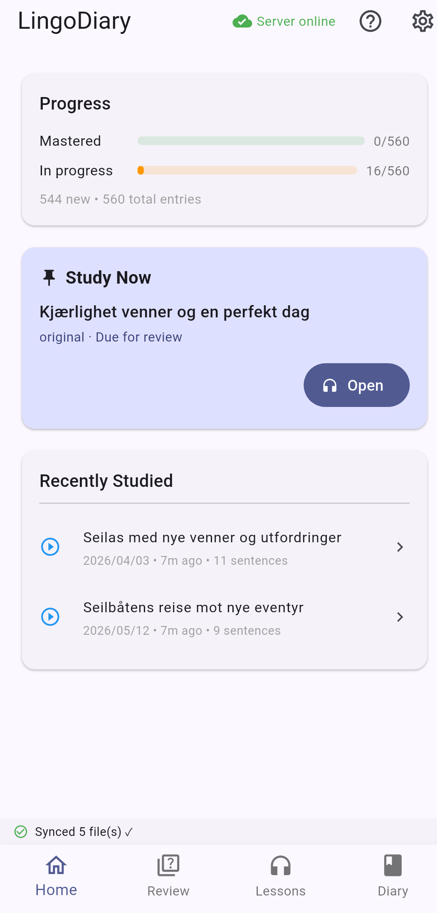
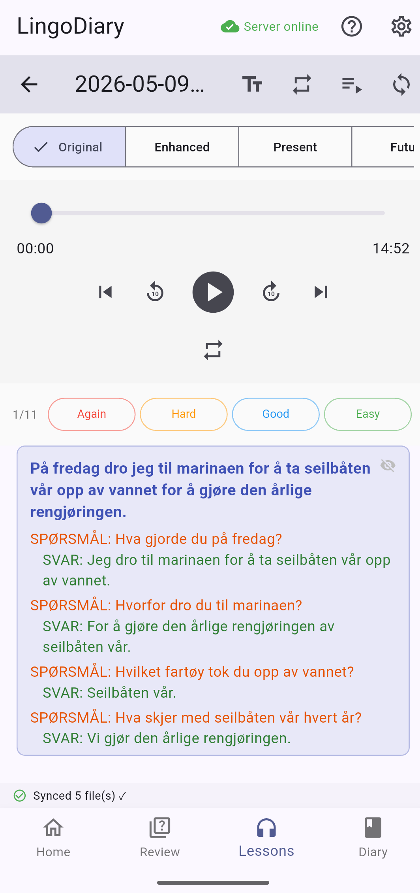

# LingoDiary

Write diary entries in your own language. LingoDiary turns them into TPRS-style audio lessons — translated sentences, Q&A pairs, and multiple grammatical variants — ready to listen on your phone or in the browser.

---

## Quick start

**You need:** Docker, Docker Compose, and an OpenAI API key.

Create a `docker-compose.yml` anywhere on your machine:

```yaml
services:
  lingo-diary:
    image: lozzaroo/lingodiary
    ports:
      - 8083:8084
    volumes:
      - ~/.config/lingoDiary/:/app/.config/lingoDiary/
      - ~/Documents/lingodiary/:/data/
    environment:
      SECRET_KEY: "change-me-to-a-random-string"
```

Then create the directories and config files the container expects (replace `myuser` with your username):

```bash
mkdir -p ~/.config/lingoDiary/myuser
mkdir -p ~/Documents/lingodiary/myuser
```

Generate a bcrypt hash for your password:

```bash
python3 -c "import bcrypt; print(bcrypt.hashpw(b'yourpassword', bcrypt.gensalt()).decode())"
```

Create `~/.config/lingoDiary/users.yaml`:

```yaml
users:
  myuser:
    password: "$2b$12$..." # paste your bcrypt hash here
    language: "en"
```

Create `~/.config/lingoDiary/myuser/config.yaml`:

```yaml
openai:
  key: "sk-..."
  model: "gpt-4o-mini"

languages:
  primary_language: "english" # the language you write your diary in
  primary_language_code: "en"
  study_language: "norwegian" # the language you are learning
  study_language_code: "no"

gender: "male"

tts:
  model: "piper"
  piper:
    voice: "talesyntese-medium"
    piper_length_scale_tprs: 2 # speech speed (higher = slower)
    piper_length_scale_diary: 2
  repeat_sentence_tprs: 2
  repeat_sentence_diary: 2
  pause_between_sentences_duration: 600
  answer_silence_duration: 5000
```

Pull the image and start:

```bash
docker compose pull
docker compose up -d
```

The server runs at `http://localhost:8083`.

---

## Web app

Open `http://localhost:8083` in your browser and log in. Write diary entries, trigger generation, and listen to lessons — all from the browser.

---

## Android app

Download the latest APK from the [Releases](../../releases) tab and install it on your phone.

Open the app, and enter your server URL (e.g. `http://192.168.1.x:8083`). Log in with your username and password.

|               Home Screen                |               Lesson Screen                |
| :--------------------------------------: | :----------------------------------------: |
|  |  |

---

## Build from source

Only needed if you want to modify the code. The first build is slow (compiles PyTorch, Whisper, and Piper TTS).

```bash
git clone https://github.com/lbesnard/LingoDiary.git
cd LingoDiary
docker compose up --build -d
```

To build the Android APK locally:

```bash
cd android_app && flutter build apk --release
# APK: android_app/build/app/outputs/flutter-apk/app-release.apk
```
